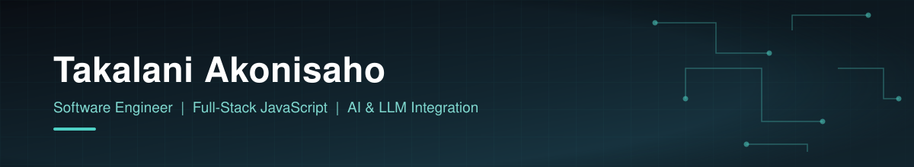

  

  

  

  Full-stack engineer and Team Captain at Motsoeneng Bill, based in Johannesburg. I build production-grade systems solo — from a Law Society-compliant trust accounting platform to self-hosted AI tools that run on local LLMs instead of shipping your data to a cloud API. BSc Mathematics & Computer Science student (UNISA), National Diploma in Informatics (TUT, 75.21%).

  
  

---

### 🚀 Featured Projects

| Project | Impact | Highlights | Stack |
|---|---|---|---|
| **[MB SmartTrack](https://github.com/Akonisaho/mb-smarttrack)** Legal Practice Management System | 🟢 In production · saving **R407,100/yr** | 7 role-based dashboards · Law Society-compliant trust accounting (8 modules) · FICA tracking · [Live demo ↗](https://mb-smarttrack.vercel.app) | `Next.js` `Node.js` `Electron` `PostgreSQL` `Supabase` |
| **[Claim Verifier Agent](https://github.com/Akonisaho/claim-verifier-agent)** AI Fact-Checking Agent | 🔵 Catches claims that are technically true but deceptively framed | Atomic claim extraction · independent context auditing · human-reviewable verdicts, not a black box | `Python` `Ollama` `Llama 3.2` `Flask` `Docker` |
| **[Inbox Relief](https://github.com/Akonisaho/inbox-relief)** Self-Hosted AI Email Assistant | 🟣 Zero data leaves the machine — ready to demo | Electron tray app · Gmail + Outlook ingestion · local-LLM triage · multi-tenant PostgreSQL RLS | `Electron` `FastAPI` `Qdrant` `Ollama` `React` |
| **[UniPath](https://github.com/Akonisaho/unipath)** Career Guidance Platform | 🟠 Serves all 26 SA public universities | One registration, one upload, apply everywhere · Gemini-powered course matching | `Next.js` `React Native` `Gemini API` `Supabase` |

---

### 🧠 What I'm focused on

- **AI that shows its reasoning** — verification pipelines with audit trails and context-checking, not single-prompt black boxes.
- **Local-first AI** — running models on owned infrastructure (Ollama) instead of routing sensitive data through a third-party cloud API.
- **Full ownership** — I've solo-shipped systems that firms actually run daily in production, not just prototypes.

---

### 🛠️ Tech Stack

**Languages**

**Frontend & Mobile**

**Backend & Desktop**

**AI & LLM Tooling**

**Databases**

**Cloud, DevOps & Tools**

---

### 📊 GitHub Stats

  
  

